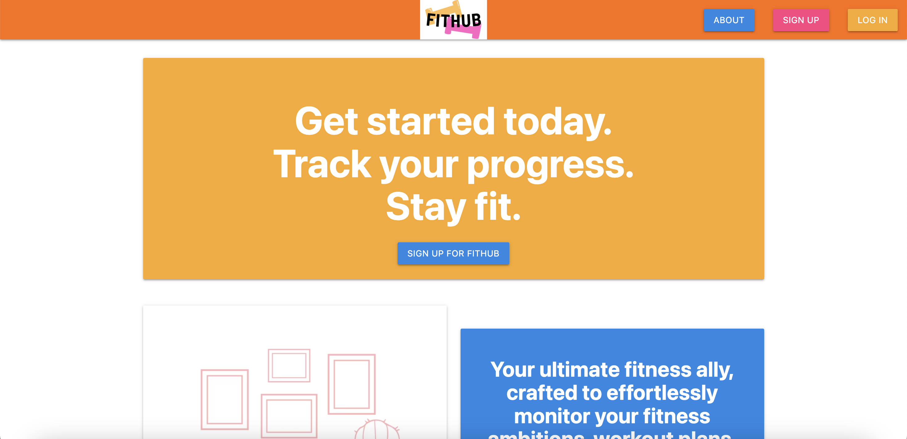
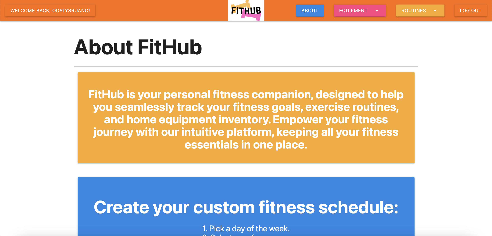
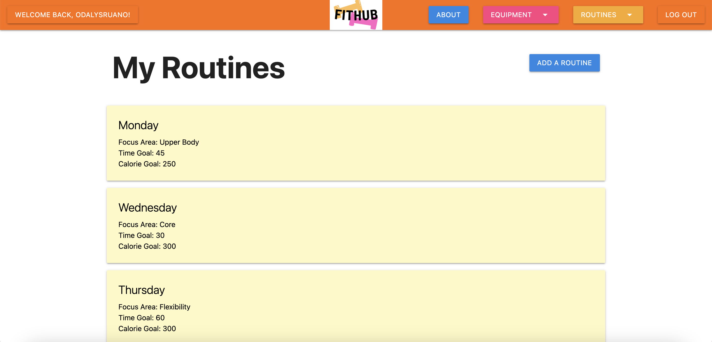
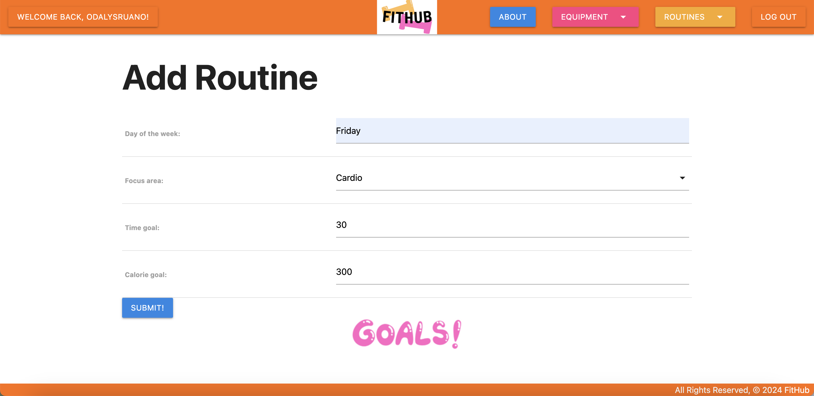
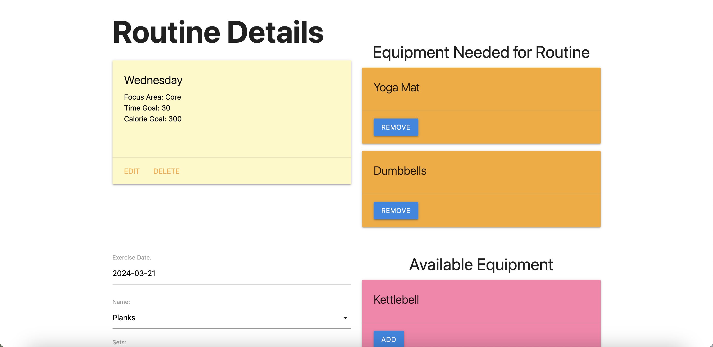
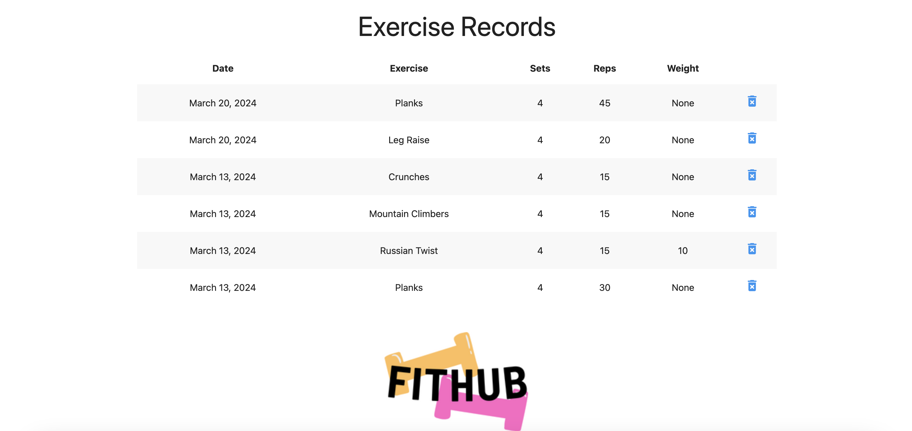
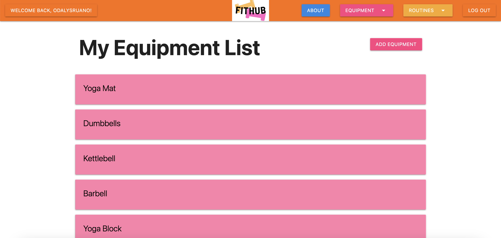
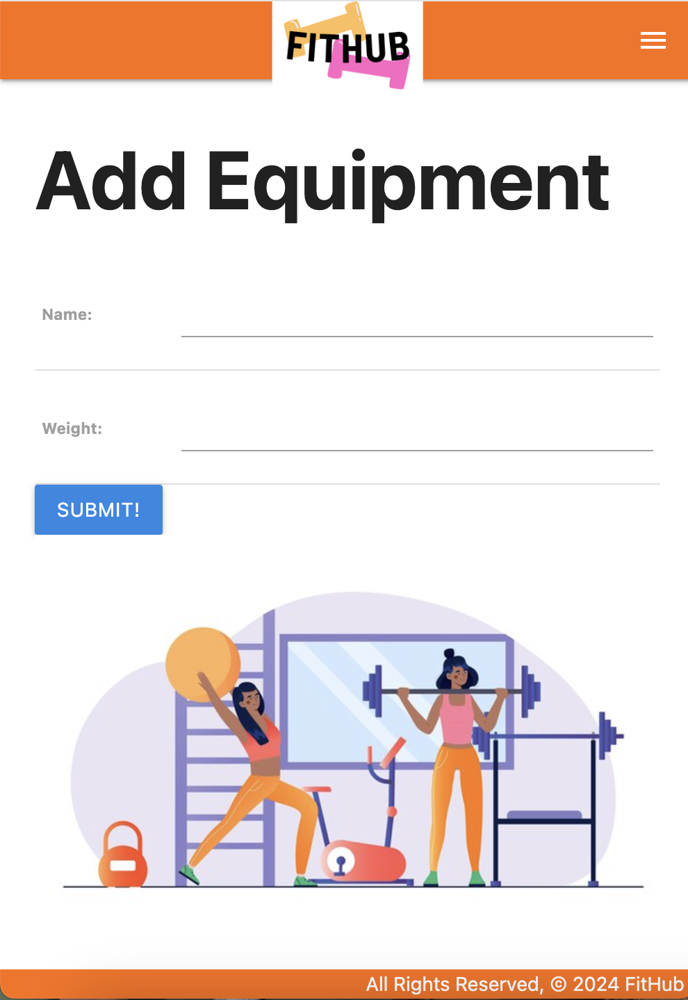
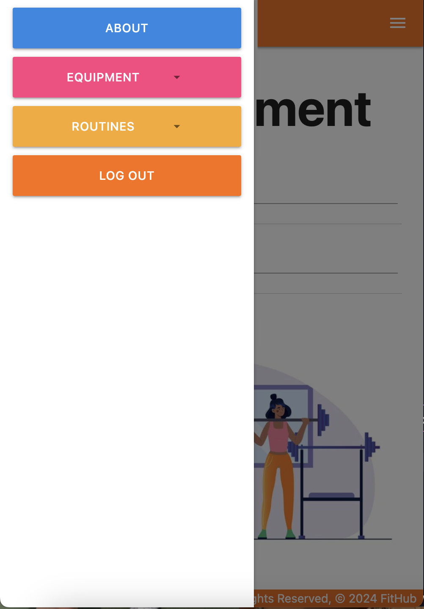

# FitHub
Link to App: http://fithub-app.us-east-1.elasticbeanstalk.com/

## App Description
FitHub is your personal fitness companion, designed to help you seamlessly track your fitness goals, exercise routines, and home equipment inventory. Empower your fitness journey with our intuitive platform, keeping all your fitness essentials in one place.

## App Screenshots
Home Page:

About Page:

View All My Routines:

Form to Add a Routine:

Routine Details:

Exercise Records:

My Equipment List:

Mobile - Form:

Mobile - Nav:

## Technologies Used
- Python
- JavaScript
- HTML
- CSS
- Materialize
- PostgreSQL
- Django
- AWS CodeBuild
- AWS CodePipeline
- AWS EC2
- AWS Elastic Beanstalk

## Getting Started
Link to App: http://fithub-app.us-east-1.elasticbeanstalk.com/

Trello Board: https://trello.com/b/xALkeXvo/fithub-project-3

Freeform (Wireframe & ERD): https://www.icloud.com/freeform/0b12awSiVmQg98r8pW4pQinVw#FitHub_-_Wireframe/ERD

## Next Steps
Planned future enhancements include enabling the user to shuffle around the cards on the "My Routines" page, so that the user can further customize and organize their fitness routine. Also, to allow the user to enter a "Custom" exercise of their own creation.
